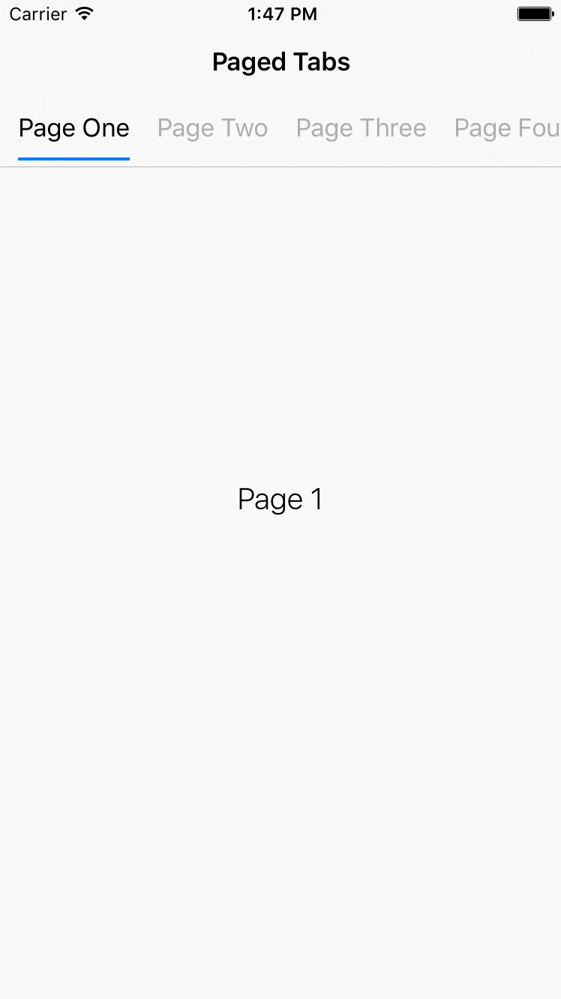

# MSSTabbedPageViewController
[](https://travis-ci.org/MerrickSapsford/MSSTabbedPageViewController)
[]()

MSSTabbedPageViewController is a UIViewController that provides a simple to implement page view controller with scrolling tab bar. It also includes a UIPageViewController wrapper that provides improved data source and delegation methods.

<div style="width:100%;">

</div>

<p><p>

## Installation
MSSTabbedPageViewController is available through [CocoaPods](http://cocoapods.org). To install it, simply add the following line to your Podfile:

    pod "MSSTabbedPageViewController"

## Usage
To run the example project, clone the repo. Use `pod install` in your project.

To use the tabbed page view controller, simply create a `UIViewController` that is a subclass of `MSSTabbedPageViewController`. Then implement the following data source method:

```
// array of view controllers to display in page view controller
- (NSArray *)viewControllersForPageViewController:(MSSPageViewController *)pageViewController;
```

If you are using a `UINavigationController` (As shown in Example project) you can embed the tab bar in the navigation bar. Simply set the `UINavigationBar` class in the navigation controller to `MSSTabNavigationBar` and the navigation bar will attach to the view controller.

Otherwise you must attach a `MSSTabBarView` via the `tabBarView` property on `MSSTabbedPageViewController`, and setting the `dataSource` and `delegate` of the `MSSTabBarView` to the view controller. 

The attached tab bar will automatically get the number of pages and display default titles for each page. To customise the content of the tabs in the tab bar override the following:

```
- (void)tabBarView:(MSSTabBarView *)tabBarView
       populateTab:(MSSTabBarCollectionViewCell *)tab
           atIndex:(NSInteger)index;
```

Child view controllers can have access to components of the parent controller by implementing the `MSSTabbedPageChildViewController` protocol:

```
// Parent page view controller
@property (nonatomic, weak) MSSPageViewController *pageViewController;

// The page index of the child view controller
@property (nonatomic, assign) NSInteger pageIndex;

// Parent tab bar view
@property (nonatomic, weak) MSSTabBarView *tabBarView;
```

### Page View Controller Enhancements

MSSPageViewController is a UIViewController wrapper for UIPageViewController that provides a simpler data source and enhanced delegation methods. The data source methods are encapsulated in the `MSSTabbedPageViewControllerDataSource` as seen above. 

The delegate methods that `MSSPageViewControllerDelegate` provides are listed below:

```
- (void)pageViewController:(MSSPageViewController *)pageViewController
     didScrollToPageOffset:(CGFloat)pageOffset
                 direction:(MSSPageViewControllerScrollDirection)scrollDirection;
```
Called when the page view controller is scrolled by the user to a specific offset, similar to `scrollViewDidScroll`. The pageOffset maintains the current page position and a scroll direction is provided. 

```
- (void)pageViewController:(MSSPageViewController *)pageViewController
           didScrollToPage:(NSInteger)page;
```
Called when the page view controller completes a full scroll to a new page. 

## Appearance
`MSSTabBarView` provides properties for appearance customisation, including:

- `sizingStyle` - Whether the tab bar should size to fit or equally distribute its tabs.
- `tabStyle` - The style to use for tabs, either `MSSTabStyleText` for text or `MSSTabStyleImage` for images.
- `tabIndicatorColor` - The color of the selection indicator. Also attached to the `tintColor` of the tab bar.
- `tabTextColor` - The text colour for the tabs.
- `tabTransitionStyle` - The transition style to use for the tabs. 
- `selectionIndicatorTransitionStyle` - The transition style for the selection indicator.
 - `MSSTabTransitionStyleProgressive` to progressively transition between tabs.
 - `MSSTabTransitionStyleSnap` to snap between tabs during transitioning.
 - use `setTransitionStyle:` to set both the `selectionIndicatorTransitionStyle` and `tabTransitionStyle`.

## Requirements
Supports iOS 8 and iOS 9.

## Author
Merrick Sapsford

Mail: [merrick@sapsford.tech](mailto:merrick@sapsford.tech)
